# ART visual guide

This guide explains the main ART functionality through diagrams. GitHub renders
these Mermaid diagrams directly, so they remain readable and maintainable with
the source code.

## 1. ART in one picture

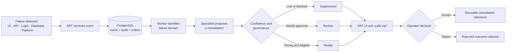

The important boundary is that ART proposes and explains a fix. It does not
directly change or deploy the target application.

## 2. System architecture

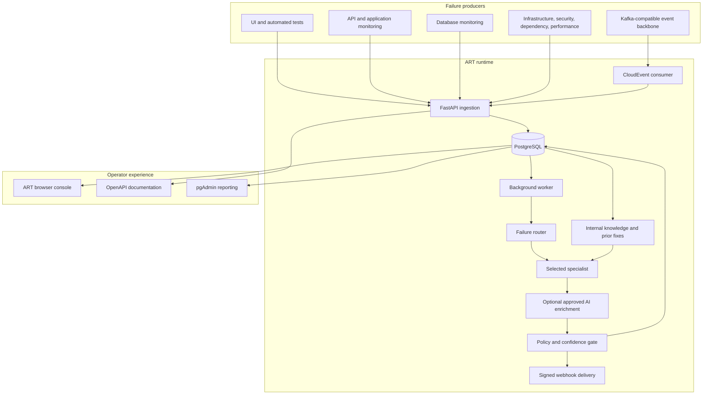

## 3. What happens after an incident is submitted

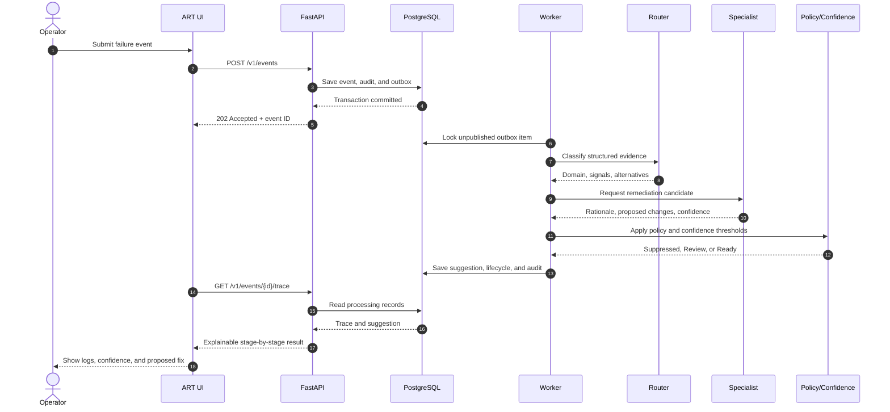

## 4. How ART recognizes the failure type

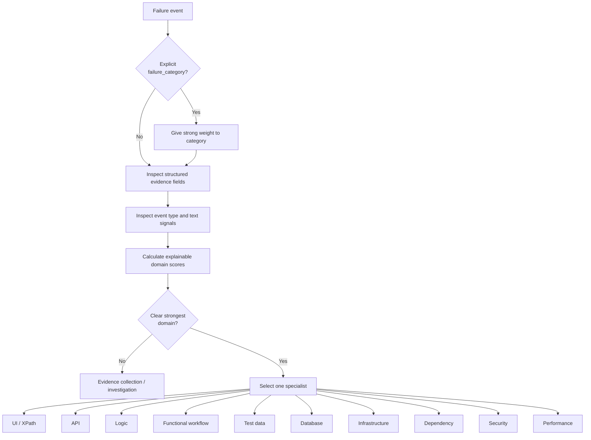

Structured fields have more influence than vague error text. If the evidence is
ambiguous, ART asks for better evidence rather than guessing a precise change.

## 5. Confidence Decision Model

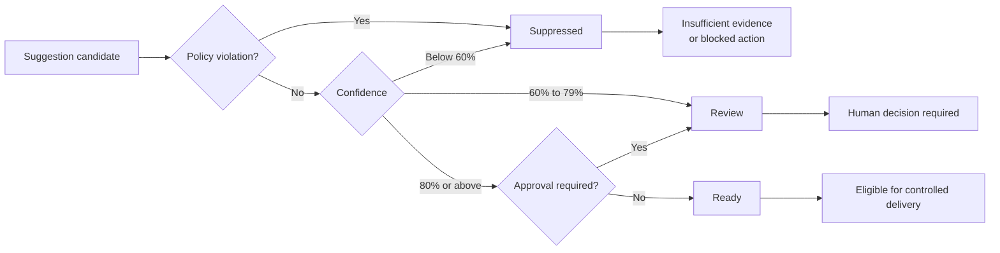

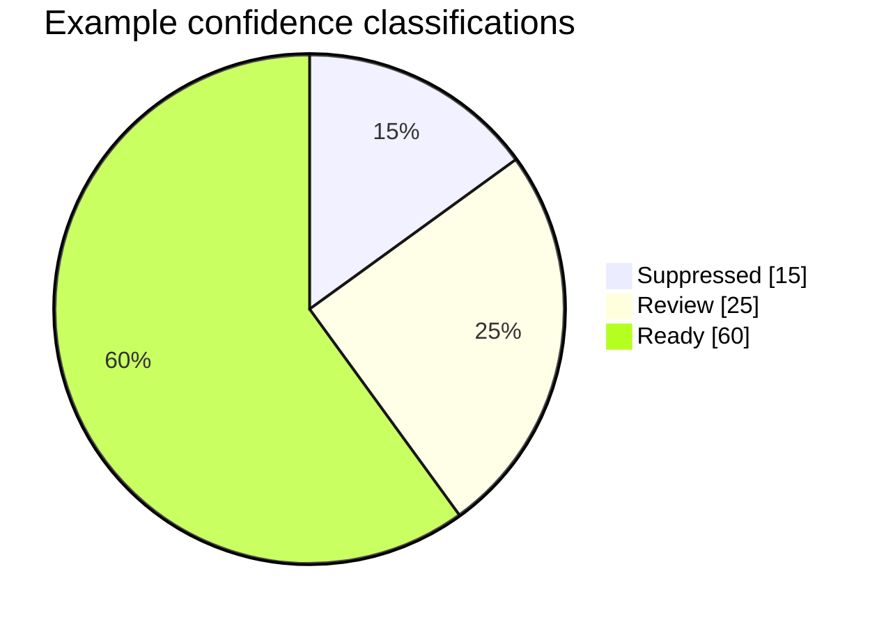

The pie chart is illustrative. The real Overview screen reads current counts
from PostgreSQL and can filter Decision Model records by state and ranking.

## 6. UI, API, and database interaction

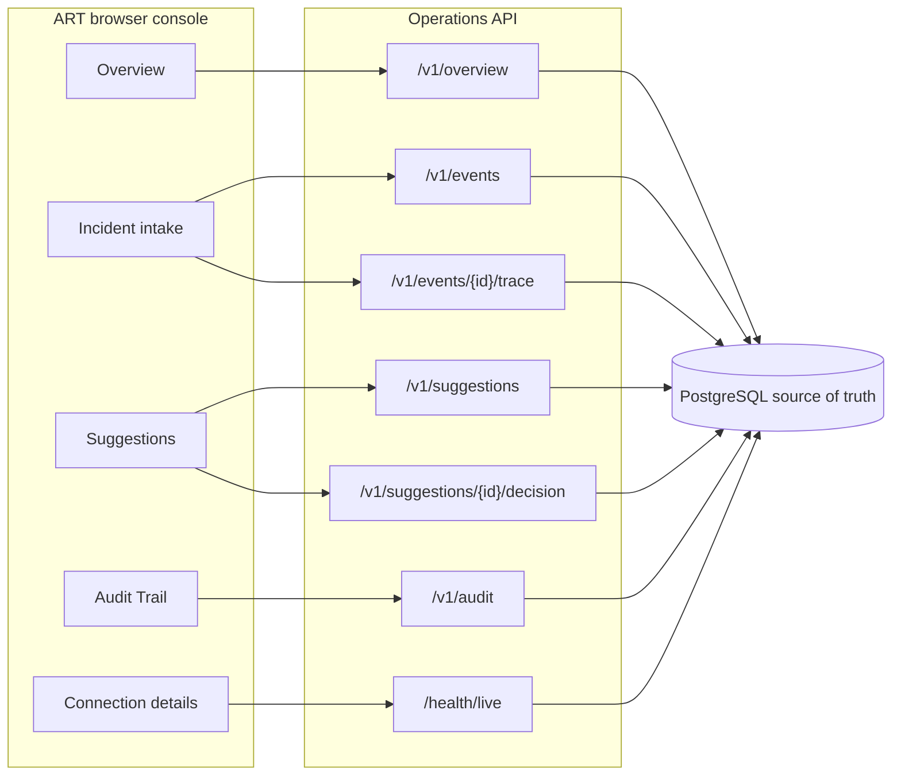

The console does not directly query PostgreSQL. It calls the API, which applies
authentication and tenant isolation before reading or writing the database.

## 7. UI navigation map

```mermaid
flowchart TB
    HOME["ART console"] --> OVERVIEW["Overview"]
    HOME --> INTAKE["Incident intake"]
    HOME --> SUGGESTIONS["Suggestions"]
    HOME --> AUDIT["Audit Trail"]
    HOME --> CONNECTION["Connection popup"]

    OVERVIEW --> METRICS["Metrics and recent incidents"]
    OVERVIEW --> DECISION["Decision Model table<br/>state + ranking filters"]

    INTAKE --> PROFILE["Choose failure domain"]
    INTAKE --> ENVELOPE["Review event envelope"]
    INTAKE --> SUBMIT["Submit and watch processing logs"]

    SUGGESTIONS --> ALL["All outcomes"]
    SUGGESTIONS --> ACCEPTED["Accepted"]
    SUGGESTIONS --> REJECTED["Rejected"]
    SUGGESTIONS --> DETAIL["Details popup"]

    AUDIT --> ENV["Environment filter"]
    AUDIT --> TIME["Preset/custom time filter"]
    AUDIT --> CORR["Correlation search"]
    AUDIT --> EXPORT["Filtered JSON export"]

    CONNECTION --> APISTATUS["API status/profile"]
    CONNECTION --> DBSTATUS["Safe PostgreSQL details"]
```

Internal Knowledge/AI and Policy Governance influence ART processing but do not
appear as primary navigation screens.

## 8. Main database relationships

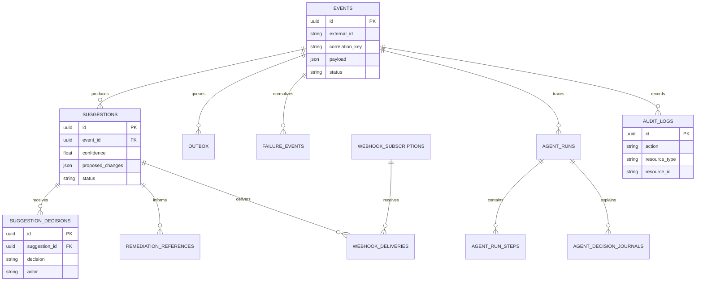

Every operational query is tenant scoped. The environment is stored inside the
event payload, while the correlation ID is stored independently.

## 9. API profile boundaries

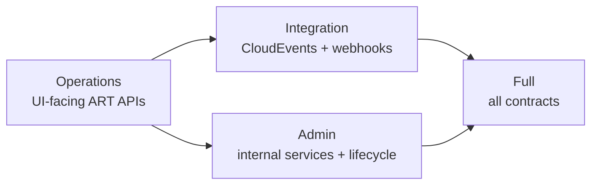

| Profile | Intended audience |
|---|---|
| Operations | ART console and normal operators |
| Integration | Event publishers and result consumers |
| Admin | Internal governance, knowledge, and lifecycle administrators |
| Full | Development, verification, and controlled combined deployments |

## 10. Deployment and environment portability

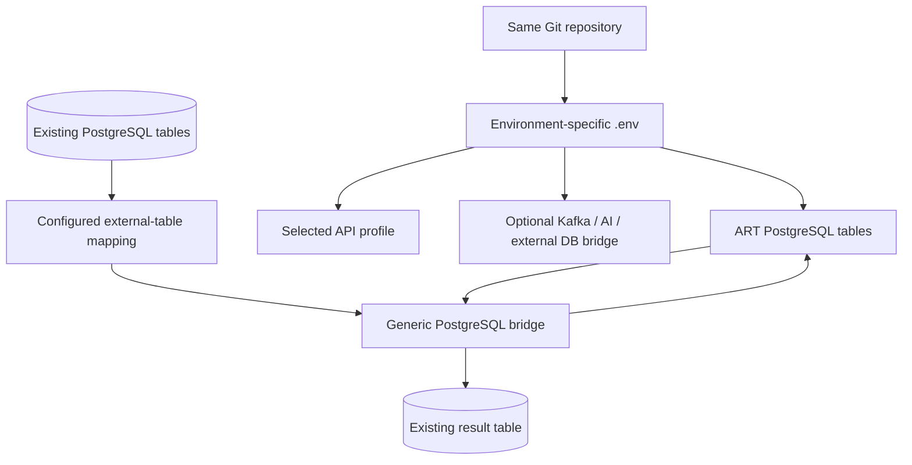

Environment-specific connection strings and table mappings belong in
configuration. Core routing, suggestion, audit, and UI code should not be
rewritten when moving the application.

## 11. Safety and responsibility boundary

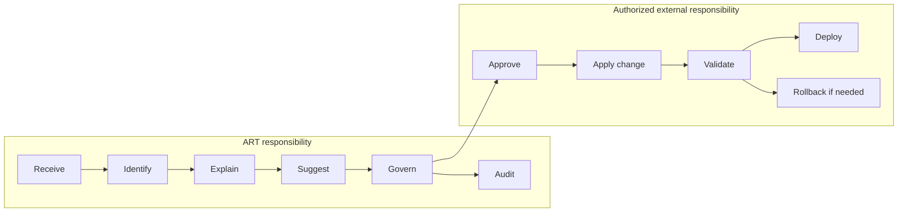

## 12. Where to read next

- [Main README](../README.md): project entry point and commands.
- [Detailed project walkthrough](PROJECT_WALKTHROUGH.md): prose explanation and
  code map.
- [Technical reference](README.md): deep implementation details.
- [Portability guide](PORTABILITY.md): other machines, environments, and
  PostgreSQL schemas.
- [pgAdmin guide](PGADMIN.md): database inspection and reporting.
- [Requirement map](ART_FEEDBACK_IMPLEMENTATION.md): document-to-code
  traceability.

